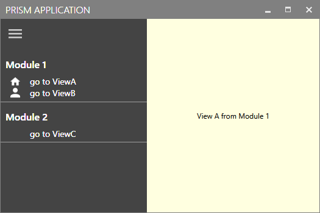

# MahAppsPrismRegionAdapters

Demo App showing how to use the [MahApps.Metro](https://github.com/MahApps/MahApps.Metro) HamburgerMenu together with a modular Prism Setup, where the Menu is populated by the Module itself.

 

Am extended version, showing more Features/Concepts can be found here: [MahAppsPrismDemo](https://github.com/WaldemarCoding/MahAppsPrismDemo)

Credit goes to [@BrianLagunas](https://twitter.com/brianlagunas) and his Twitch Streams on Building a PrismOutlook App (you can check out the archive in this [Playlist on YT](https://www.youtube.com/playlist?list=PLf48ZHxekgCMC73VWaGnQ1YuTahCndrNW)). 

---

Want to see a Demo using DevExpress AccordionControl? Take a look here: https://github.com/WaldemarCoding/DXPrismRegionAdapters
